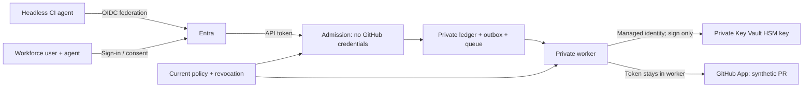

# Entra-GitHub agent identity demo

A narrowly scoped operation broker demonstrating two distinct authorisation paths:
autonomous workload identity and delegated workforce-user identity. Entra
authorises a request; the broker applies a capability policy; a GitHub App
performs the approved repository action. This is not automatic identity mapping
between Entra and GitHub.

## Current state

The durable broker, separate admission/worker modes, private-dependency Bicep,
bootstrap scripts and delegated client are implemented and locally verified.
**Azure deployment and live identity tests have not yet been completed.**
This is not a production deployment or a verified million-user implementation.
Live setup has reached a tenant-admin permission gate; paid compute remains
undeployed. See the [admin handoff](docs/runbook.md#if-tenant-permission-grants-are-denied).



Bank customers belong on the customer application/authorisation plane, **not**
one GitHub account or App per customer. The delegated demonstration uses a
workforce test account; it is not customer identity provisioning.

- [Architecture, bank-scale boundaries and cost](docs/architecture.md)
- [Deployment and headless operation runbook](docs/runbook.md)
- [Infrastructure scan decisions](docs/infrastructure-checks.md)
- [Evidence and remaining live checks](docs/evidence.md)

## Local development

Prerequisites: .NET SDK 10.0.401 or a compatible servicing patch, PowerShell 7.4+,
Azure CLI with Bicep, and Checkov for the complete infrastructure gate.

```powershell
dotnet restore .\EntraGitHubAgentIdentityDemo.slnx
dotnet build .\EntraGitHubAgentIdentityDemo.slnx -c Release --no-restore
dotnet test .\EntraGitHubAgentIdentityDemo.slnx -c Release --no-build
dotnet build .\tools\DelegatedClient\DelegatedClient.csproj -c Release
.\scripts\Test-Scripts.ps1
az bicep build --file .\infra\main.bicep
```

`GET /healthz` is anonymous liveness. `/readyz` makes bounded, real storage
checks; App Service's authentication layer protects it in Azure.
`POST /v1/maintenance-pr` durably accepts the fixed capability and returns HTTP
202. `GET /v1/operations/{id}` is authenticated and caller-isolated.
The worker exposes health endpoints only and has public ingress disabled.

Both runtimes use explicit managed identities. There is deliberately no
developer-credential or in-memory production fallback. Tests use injected fakes
and real Azure-adapter contract checks without accessing cloud services.
Configuration is documented in `.env.example`; that file is not loaded
automatically. Actual deployment state stays in ignored `.local`.

## Honesty notes

- GitHub sees a GitHub App actor, not an Entra user or an individual agent run.
- The delegated path is a workforce-user test, not a bank customer identity
  implementation. Customer consent and customer data access need a separate
  authorisation boundary.
- The operation creates synthetic maintenance metadata and a PR. It is not an
  AI coding agent, a package updater or an autonomous merge mechanism.
- Durable state, ETags and a same-partition outbox support restart and duplicate
  delivery. GitHub cannot participate in that transaction: ambiguous work is
  quarantined or reconciled read-only, not blindly rerun.
- Runtime decisions expire within five minutes and never outlive the original
  Entra token. The demo permits one active operation and six starts/hour per
  GitHub installation; this is a safety budget, not a throughput benchmark.
- Existing Entra and GitHub tokens do not become instantly invalid when an
  identity is disabled. Update the live grant/control, stop workers and use
  GitHub-side suspension/revocation as appropriate.
- GitHub App approval/installation and user sign-in remain real consent steps.
  Normal autonomous runs are headless; MFA is never automated around.
- The imported key is HSM-protected **after** trusted import. GitHub generates
  the initial private key; it is never handed to an ordinary runner.
- B1 compute is not zone-redundant. There is no WAF, regional failover or
  million-user test. See the explicitly documented scan exceptions.
- No supplied customer diagrams, meeting transcript or internal roadmap
  material are included. This is an independently written generic example.
