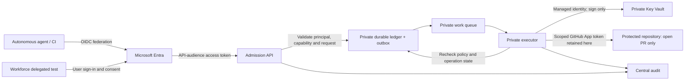

# Recommended identity architecture

Status: hardening implemented and locally verified; Azure deployment and live proof pending.
Sources retrieved: 2026-09-29.

## Decision

Use an operation broker, not a general-purpose credential vending service.
Separate admission from execution. Make work durable before acknowledging it.
Keep GitHub credentials entirely inside the executor.

Do not create a GitHub account, GitHub App, or Entra service principal for every
bank customer or every execution. Customer identities and engineering workload
identities are different security populations. A customer request should not
automatically become an engineering repository operation.

## Simplified drawing

The admission API is deliberately reachable over authenticated HTTPS for
GitHub-hosted runners and the delegated test client. It receives no Key Vault
signing permission and no GitHub token. The executor has public ingress disabled.
Key Vault and the queue/table data endpoints have public network access disabled.
VNet integration alone does not make an application's inbound endpoint private.

## Identity model

| Identity | Purpose | Must not have |
| --- | --- | --- |
| CI workload identity | Request a pre-approved capability through the admission API | Signing access, GitHub write token, storage account keys |
| Delegated user and calling application | Request a capability within both user and application entitlements | Authority based on a caller-supplied user ID |
| Admission managed identity | Persist authorised requests and dispatch work | Key Vault signing or GitHub credentials |
| Executor managed identity | Read approved work, update operation state, sign through Key Vault | Directory administration or key export |
| GitHub App | Perform narrowly scoped repository operations | Ruleset bypass, administration, workflow editing |
| Bootstrap/deployment identity | Establish and update trust with audited administrative access | Reuse as the runtime agent identity |

Use a stable governed agent/capability identifier, plus a separate execution ID.
Keep owner, sponsor, environment, permitted operations, allowed repositories,
underlying Entra principal and GitHub installation in the control-plane registry.
Provision identities per meaningful security boundary, not per transient process.
Do not hide mutually untrusted agents behind a single untraceable principal.

For a customer-facing production service, use a dedicated customer identity
boundary, such as Microsoft Entra External ID, and a customer-authorisation
service. The demo's workforce-user sign-in is only a delegated-flow test. It
does not provision customer identities or implement customer banking permissions.

Effective permission is the intersection of authenticated caller identity,
agent capability, user entitlement where applicable, GitHub installation
permissions and repository rules.

## Implemented hardening; live evidence still required

| Initial limitation | Replacement | Evidence required |
| --- | --- | --- |
| In-memory request ledger | Durable table state, caller-bound keys, conditional ETag transitions | Restart and duplicate-submission tests |
| Work lost between storage and queue | Same-partition transactional outbox plus a retrying dispatcher | Crash between commit and send; eventual dispatch |
| Concurrent workers can duplicate work | Conditional acquisition, bounded ownership, deterministic GitHub reconciliation | Two-worker race and interrupted-operation tests |
| Admission process holds signing access | Separate executor and managed identity | Admission identity receives a real signing denial |
| Public vault/storage endpoints | Private endpoints and DNS, public data access disabled | Private connectivity succeeds; external data access fails |
| Key copied into runner steps | One-time trusted import; remote signing only | Runner has no key material or signing permission |
| API response hides long-running failures | HTTP 202 plus authenticated operation-status endpoint | Failed, cancelled and ambiguous outcomes remain distinguishable |
| Local-only kill switch | Durable control-plane switch checked before dispatch and writes | Queued work stops; in-flight limits explicitly measured |
| Static policy cannot support lifecycle | Durable capability/agent registry with separate provisioning rights | Disable a grant and reject subsequent work |
| Limited attribution | Correlated admission, execution, Entra and GitHub evidence | Trace principal to operation to resulting PR |

Storage Queue delivery is at least once. Neither a queue nor a lease can
atomically commit an Azure state change and a GitHub mutation. Do not claim
distributed exactly-once execution. Reconcile deterministic branches/PRs, keep
ambiguous outcomes visible and quarantine work when safe recovery cannot be
proved. Do not silently retry arbitrary writes.

The worker must re-evaluate the current capability and revocation state.
Delegated work receives a short, explicit authorisation validity window; an old
queued message must not become perpetual user authority. Raw bearer tokens and
refresh tokens must not be persisted into the queue, operation ledger or logs.

The admission service is a trusted policy-enforcement component. A party with
operation-table write access can forge admitted decisions for existing grants;
the worker does not revalidate an original bearer token stored in the ledger
because raw tokens are deliberately not persisted. Its independent registry
check limits scope, but does not make a compromised admission service harmless.
Protect deployment control, admission code and its managed identity accordingly.

The implemented demo caps decisions at five minutes/original token expiry,
execution at 90 seconds and ownership at 120 seconds. Queue visibility is 150
seconds. A persistent installation budget allows one active operation and six
starts/hour. Idempotency records are retained indefinitely; a production
archival/tombstone strategy must preserve duplicate-suppression guarantees.

Production admission must enforce per-principal, per-capability and per-installation
budgets. Respect GitHub primary and secondary rate limits and Retry-After.
Partition by business/security ownership when required, not to evade rate limits.

## Recommended small Azure footprint

- Two separate Linux App Service B1 plans: admission and executor.
- Separate managed identities, including the federated CI identity.
- A VNet with separate application-integration and private-endpoint subnets.
- StorageV2 Standard_ZRS with separate table and queue private endpoints.
- Key Vault Premium with an imported RSA-HSM GitHub App key, sign-only executor
  access, soft delete, purge protection and a private endpoint.
- Three private DNS zones and central diagnostic logs.
- Entra app role for workload access and a separate delegated scope/public client.

Separate plans avoid coupling admission and execution capacity. B1 is a small
demo tier, not zone-redundant or autoscaling production compute. A production
deployment needs independent scaled plans or worker pools, a protected ingress
tier, recovery objectives and regional redundancy appropriate to bank policy.

Avoid a container registry, Kubernetes cluster, always-on firewall or premium API
gateway merely for this small demonstration. Those are production choices to
justify against the existing bank platform, not automatic prerequisites.

The documented App Service remote-package deployment path supports network-secured
apps. The scripts enable immutable GitHub releases, upload a draft artifact,
publish it, and check the server-reported SHA-256 before deployment. Use
versioned public demo release artifacts with no environment
configuration or secrets; keep private deployment credentials and private keys
out of all artifacts.

Azure Monitor uses its public service endpoints with Entra/RBAC and local
authentication disabled. This demo does not deploy Azure Monitor Private Link
Scope. Diagnostic logs are not a claim of private telemetry transport or
tamper-proof regulatory evidence.

## Bootstrap and headless operation

Entra identities, federated credentials, app-role assignments, scoped Azure RBAC,
repository environments and policy configuration should be scripted and repeatable.

GitHub App registration and installation require administrator approval.
Use the supported manifest flow, not browser-cookie automation or a PAT fallback.
The GitHub-generated RSA private key is imported from a trusted bootstrap process;
HSM protection begins after import. This is not an HSM-generated-key ceremony.

A private vault requires private bootstrap connectivity. If the operator lacks
that connectivity, an explicitly approved, temporary operator-IP-only bootstrap
window can be used. The final state must disable public access and remove
temporary bootstrap rights. Do not quietly reopen the vault.

The supplied temporary-window script closes access in `finally` and verifies the
result. An abruptly killed process, machine outage or loss of control-plane
permission can prevent cleanup: `Close-Bootstrap.ps1` is the explicit recovery
command. There is no server-side automatic firewall-rule expiry. A bank should
prefer a private administrative runner with appropriately authorised networking,
not make repeated public bootstrap exceptions its operating model.

For delegated access, user authentication and consent remain required, subject
to Conditional Access. Do not automate around MFA or turn a delegated flow into
an application-only flow. Normal autonomous runs must need no user interaction.

## Scale and remaining boundaries

Microsoft Entra Agent ID is publicly documented as available. It is an appropriate
candidate for governed agent lifecycle where its features and licensing fit.
It is not an automatic mapping to a GitHub principal. The current FAQ documents
a 250-agent-per-blueprint limit for non-Microsoft platforms using app-only
provisioning, plus directory quotas. Validate tenant-specific limits before
selecting identity cardinality.

Millions of customers do not imply millions of GitHub actors. Keep customer
activity on the customer application plane. Only a deliberately authorised
engineering capability crosses into the GitHub integration plane.

GitHub still records the App actor. Maintain a correlated audit record; do not
claim GitHub natively displays the originating Entra customer, user or agent run.
Disabling an Entra principal is not instant revocation of an already-issued
Entra or GitHub token. The demo does not poll Microsoft Graph account status or
implement continuous access evaluation. Propagate lifecycle changes into the
live grant registry. Retaining GitHub tokens in the executor, a worker kill switch, token
revocation, and GitHub-side suspension reduce the residual window but do not
undo an already-completed action.

No test in this repository currently proves million-user throughput, regional
failover, production customer delegation or regulatory compliance.

## Cost planning

Illustrative low-usage estimate in Australia East, retrieved 2026-09-29:

| Item | Approximate USD/month |
| --- | ---: |
| Two Linux B1 plans, 2 x 730 hours x $0.019 | 27.74 |
| Three standard private endpoints, 3 x 730 hours x $0.01 | 21.90 |
| Three private DNS zones | 1.50 |
| One RSA-2048 HSM-protected key | 1.00 |
| 10,000 ordinary Key Vault operations | 0.03 |
| 1 GB combined diagnostic ingestion, no free-grant assumption | 3.34 |
| Storage, transactions, private-link traffic and DNS queries | Usage-based |

Known base and illustrative logging/signing usage total $55.51. Use approximately
$60/month as a low-usage planning figure, not a quote or spending cap. This excludes
tax, GitHub charges, larger workloads and production gateway/DR services. Storage
charges depend on retained state and polling/transaction volume.

## Sources

- [Web-Queue-Worker architecture](https://learn.microsoft.com/azure/architecture/guide/architecture-styles/web-queue-worker)
- [Asynchronous request-reply](https://learn.microsoft.com/azure/architecture/patterns/async-request-reply)
- [Table partitioning and entity group transactions](https://learn.microsoft.com/azure/storage/tables/table-storage-design)
- [App Service VNet integration](https://learn.microsoft.com/azure/app-service/overview-vnet-integration)
- [Private endpoints for Storage](https://learn.microsoft.com/azure/storage/common/storage-private-endpoints)
- [Key Vault Private Link](https://learn.microsoft.com/azure/key-vault/general/private-link-service)
- [Deploy to network-secured App Service](https://learn.microsoft.com/azure/app-service/deploy-zip#deploy-to-network-secured-apps)
- [Entra workload identity federation](https://learn.microsoft.com/entra/workload-id/workload-identity-federation)
- [Microsoft Entra Agent ID](https://learn.microsoft.com/entra/agent-id/what-is-microsoft-entra-agent-id)
- [Agent ID limits and lifecycle considerations](https://learn.microsoft.com/entra/agent-id/faq)
- [GitHub App key management](https://docs.github.com/en/apps/creating-github-apps/authenticating-with-a-github-app/managing-private-keys-for-github-apps)
- [GitHub App manifest registration](https://docs.github.com/en/apps/sharing-github-apps/registering-a-github-app-from-a-manifest)
- [Immutable releases](https://docs.github.com/en/code-security/concepts/supply-chain-security/immutable-releases)
- [Azure Retail Prices API](https://prices.azure.com/api/retail/prices)
